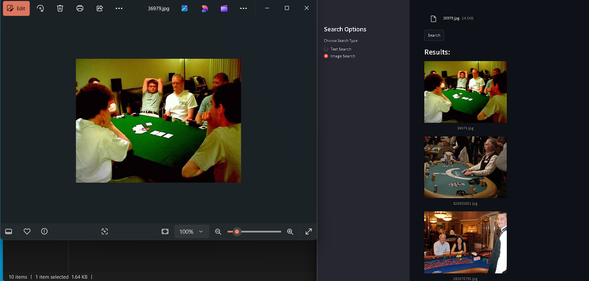

# 📌 Multimodal AI - Image & Text Search Engine (CLIP + FAISS)

## 🏆 **Project Overview**
This project is a **Multimodal AI Search Engine** that enables users to **search for images using text queries and vice versa**. It is powered by **OpenAI's CLIP model** for embedding extraction and **FAISS** for fast similarity search.

---

## 📂 **Project Structure**

### 🔹 **Input:**
- **User uploads an image or enters a text query**.
- The system encodes both text and image into a **shared feature space**.

### 🔹 **Processing:**
1. **Feature Extraction:** CLIP model encodes images & text into embeddings.
2. **Indexing & Search:** FAISS indexes embeddings for fast similarity search.
3. **Ranking & Retrieval:** Top-K most relevant images or text results are retrieved.

### 🔹 **Output:**
- **Returns the most relevant images for a given text query** or vice versa.

---

## 📌 **Dataset Information**
This project uses a **merged dataset of Flickr8k & Flickr30k** for improved performance and diversity.

### 🔹 **Dataset Setup Instructions:**
1. **Download Flickr8k and Flickr30k datasets** manually from [Kaggle](https://www.kaggle.com/datasets).
2. **Extract all images** into the following directory:
   ```
   multimodal_ai/datasets/images
   ```
3. **Merge the captions from both datasets** and save as:
   ```
   multimodal_ai/datasets/final_captions.csv
   ```
4. **Ensure the final CSV file contains one caption per image (merged from 5 captions).**

🔹 **Note:** Images are not included in this repository due to large file size.

---

## 📌 **Tech Stack & Dependencies**

### **Core AI Components:**
✅ **CLIP (Contrastive Language-Image Pretraining)** – OpenAI's model for multimodal embeddings.  
✅ **FAISS (Facebook AI Similarity Search)** – Efficient nearest neighbor search.  
✅ **Torch & Hugging Face Transformers** – For working with pretrained models.  
✅ **OpenCV & PIL** – For image processing.  

### **Backend & Deployment:**
✅ **FastAPI** – High-performance API framework.  
✅ **Uvicorn** – ASGI server for running FastAPI.  
✅ **Streamlit** – Simple UI for testing search queries.  
✅ **SQLite / PostgreSQL** – For metadata storage.  
✅ **Docker (Optional)** – For containerization.  
✅ **Jupyter Notebook (Training) & VSCode (Modular Coding)** – As per user preference.  

---

## 🛠️ **Installation & Setup**

### **1️⃣ Clone the Repository**
```bash
git clone https://github.com/Kartik-A-1820/multimodal-ai-search.git
cd multimodal-ai-search
```

### **2️⃣ Install Dependencies**
```bash
pip install -r requirements.txt
```

### **3️⃣ Prepare Dataset**
Ensure images are placed in:
```
multimodal_ai/datasets/images/
```
And the merged captions file is stored as:
```
multimodal_ai/datasets/final_captions.csv
```

---

## 🚀 **Running the Project**

### **1️⃣ Start the FastAPI Backend**
```bash
uvicorn app:app --host 0.0.0.0 --port 8000 --reload
```

### **2️⃣ Run the Streamlit UI**
```bash
streamlit run ui.py
```

Once started, visit:
- **FastAPI Docs:** [http://127.0.0.1:8000/docs](http://127.0.0.1:8000/docs)
- **Streamlit UI:** [http://127.0.0.1:8501](http://127.0.0.1:8501)

---

## 🔥 **Screenshots of the Project**

### **Text-to-Image Search Example:**


### **Image-to-Image Search Example:**


---

## 🔥 **API Endpoints**

### **1️⃣ Text-to-Image Search**
```bash
GET /search_by_text?query="dog running on the field"
```
✅ **Response:**
```json
{
    "query": "dog running on the field",
    "results": ["image1.jpg", "image2.jpg", "image3.jpg"]
}
```

### **2️⃣ Image-to-Image Search**
```bash
POST /search_by_image
```
✅ **Example cURL Request:**
```bash
curl -X 'POST' \
  'http://127.0.0.1:8000/search_by_image' \
  -H 'accept: application/json' \
  -H 'Content-Type: multipart/form-data' \
  -F 'file=@your_image.jpg'
```
✅ **Response:** List of matching images.

---

## 🎯 **Expected Outcome**
✅ **Fully functional AI-powered search engine**  
✅ **Fast multimodal retrieval using FAISS**  
✅ **Live API & UI hosted online**

---

## ⭐ **Support & Feedback**
If you find this project useful, give it a ⭐ on GitHub!

---

### 🔗 **Connect with Me:**
- GitHub: [Kartik-A-1820](https://github.com/Kartik-A-1820)
- LinkedIn: [Kartik Anagawadi](https://www.linkedin.com/in/kartik-anagawadi-4b33a81b6/)

🚀 **Happy Searching!** 🔍
